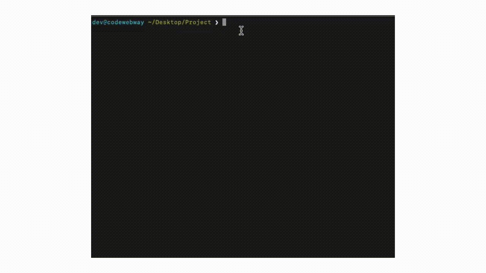

[](https://github.com/iylmwysst/CodeWebway/actions/workflows/ci.yml)
[](https://github.com/iylmwysst/CodeWebway/actions/workflows/codeql.yml)
[](https://github.com/iylmwysst/CodeWebway/releases/latest)
[](LICENSE)

```text
      ____          _     __        __   _
     / ___|___   __| | ___\ \      / /__| |____      ____ _ _   _
    | |   / _ \ / _` |/ _ \\ \ /\ / / _ \ '_ \ \ /\ / / _` | | | |
    | |__| (_) | (_| |  __/ \ V  V /  __/ |_) \ V  V / (_| | |_| |
     \____\___/ \__,_|\___|  \_/\_/ \___|_.__/ \_/\_/ \__,_|\__, |
                                                            |___/
```

> **Browser-based remote terminal and file editor — standalone or dashboard-controlled, with no port forwarding required.**

CodeWebway is a single Rust binary that gives you a full terminal and file editor in the browser, on any device. It is built for developers working on machines behind firewalls, NAT, or institutional networks where traditional SSH access is not practical.

It can run in two ways:

- **Standalone:** run `codewebway -z` and open the generated URL directly.
- **With WebWayFleet:** register the machine once, then start and stop browser terminals from the dashboard without SSH.



## How It Works

```text
Browser  ──HTTPS──▶  zrok edge  ──tunnel──▶  CodeWebway  ──PTY──▶  Shell
```

- The diagram above is the standalone `codewebway -z` path.
- One process serves both the backend and the web UI — no separate frontend server.
- Terminal sessions are real server-side PTYs with scrollback replay on reconnect.
- Works on any modern browser — desktop, tablet, or mobile (iOS and Android tested).
- The server binds to `127.0.0.1` by default. Public access is opt-in via `--zrok` or a reverse proxy.

With WebWayFleet, the same host can also be opened through dashboard-approved host login, signed launch URLs bound to the current runtime instance, and a short-lived runtime token fallback reserved for recovery.

## Quick Start

### Standalone

**Install (macOS / Linux)**

```bash
curl -fsSL https://raw.githubusercontent.com/iylmwysst/CodeWebway/main/install.sh | sh
```

**Run**

```bash
codewebway -z
```

If you start from an interactive terminal, CodeWebway will prompt for a machine PIN, generate an access token if needed, and print the public URL. Open the URL, log in, and you have a terminal.

### With WebWayFleet

```bash
# first-time registration
codewebway enable

# inspect local registration and remote fleet metadata
codewebway status

# long-running daemon for dashboard start/stop
codewebway fleet
```

`enable` supports QR/device-code setup for headless machines, stores local fleet credentials, and can install an auto-start service on macOS or Linux.
`status` prints local fleet registration details and best-effort remote metadata without exposing the raw machine token.

→ Full CLI reference and examples: [USAGE.md](USAGE.md)
→ Security model and threat analysis: [SECURITY.md](SECURITY.md)
→ Contributing and project scope: [CONTRIBUTING.md](CONTRIBUTING.md)

## When to Use CodeWebway

CodeWebway is optimized for a specific gap: **single-operator remote access from a machine you do not fully control the network on.**

It is not a VPN replacement. It is not an enterprise access platform. It fills the space where those tools are impractical:

- Your machine is behind a university, corporate, or ISP NAT with no port forwarding.
- You cannot get the network team to open a firewall rule.
- You tried VPN but it disconnects on every Wi-Fi handoff or wakes from sleep.
- You want a browser tab, not a separate SSH client install.

**Common use cases**

```bash
# Trigger a build on a remote machine from your laptop's browser
codewebway -z --cwd ~/project

# Register a Pi/Jetson once, then start terminals later from WebWayFleet
codewebway enable
codewebway fleet

# Let an AI coding agent access a remote shell session
codewebway -z --temp-link --temp-link-scope interactive

# Share a read-only terminal view for debugging help
codewebway -z --temp-link --temp-link-scope read-only --temp-link-ttl-minutes 15

# File-access disabled — terminal only
codewebway -z --terminal-only
```

**Not suitable for**

- Multi-user environments or shared team access
- Replacing a zero-trust access platform (Tailscale, Cloudflare Access)
- Exposing production infrastructure or sensitive services
- Any scenario that depends on rich multi-user collaboration or role separation

## Comparison

The table below compares tools in the context CodeWebway is designed for:

- You do not control the router or firewall (university, corporate, shared office)
- Only outbound HTTPS is reliably permitted
- Installing a VPN client or kernel module is not an option

All comparisons reflect default/typical configuration. Many tools can be configured beyond their defaults (e.g. SSH over a reverse tunnel, ttyd behind a reverse proxy) — footnotes call out the most important cases.

| | CodeWebway + zrok | OpenSSH¹ | SSH + VPS | Tailscale | ttyd² |
|---|---|---|---|---|---|
| **Requires inbound port/firewall rule** | No | Yes | No | No | Yes |
| **Requires router or firewall control** | No | Yes | No | No | Yes |
| **Passes outbound HTTPS-only networks** | ✅ likely | ❌ | ⚠ depends | ⚠ DERP fallback | ❌ |
| **Connection layer** | Application | Network | Network | Network mesh | Application |
| **Stable across Wi-Fi changes** | ✅ | ❌ reconnects¹ | ❌ reconnects | ⚠ | ✅ |
| **Direct cost** | Free | Free | ~$5/mo VPS | Free (small scale) | Free |
| **Needs VPS** | No | No | Yes | No | No |
| **Built-in multi-factor login** | ✅ token + PIN | ❌ | ❌ | ❌ | ❌ |
| **Browser-native (no client install)** | ✅ | ❌ | ❌ | ❌ | ✅ |
| **File editor included** | ✅ | ❌ | ❌ | ❌ | ❌ |
| **Single binary** | ✅ | ❌ | ❌ | ❌ | ✅ |

¹ Vanilla SSH without autossh/mosh. A reverse SSH tunnel eliminates the port forwarding requirement but adds setup complexity and requires a reachable VPS.

² ttyd can run behind a reverse proxy without direct port exposure, but requires separate proxy configuration.

**On outbound HTTPS:** CodeWebway + zrok uses standard outbound HTTPS, which is commonly allowed in institutional networks. No protocol is guaranteed to pass every environment — deep packet inspection can block any traffic — but HTTPS tunnels are the most likely to work where UDP-based protocols (Tailscale WireGuard, WireGuard VPN) and non-standard ports are filtered.

**On connection stability:** The comparison is against vanilla SSH sessions, which must fully re-establish the TCP connection after a network change. CodeWebway operates at the application layer — a brief drop causes a WebSocket reconnect without tearing down the server-side PTY session. Tools like `mosh` address this for SSH specifically, but require separate installation on both ends.

**On cost:** "free" tools can still require infrastructure access. Direct SSH from outside a NAT needs either port forwarding (requires router control) or a VPS as a relay. CodeWebway + zrok needs neither.

## Tech Stack

| Component | Library |
|---|---|
| HTTP + WebSocket | `axum` |
| PTY | `portable-pty` |
| Async runtime | `tokio` |
| Embedded assets | `rust-embed` |
| CLI | `clap` |
| Terminal renderer | `xterm.js` |

## License

GNU AGPL v3.0. See [LICENSE](LICENSE).
