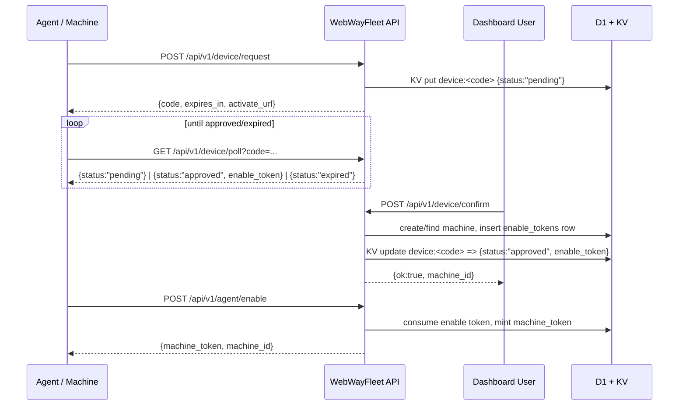
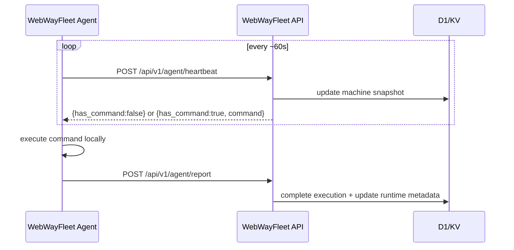
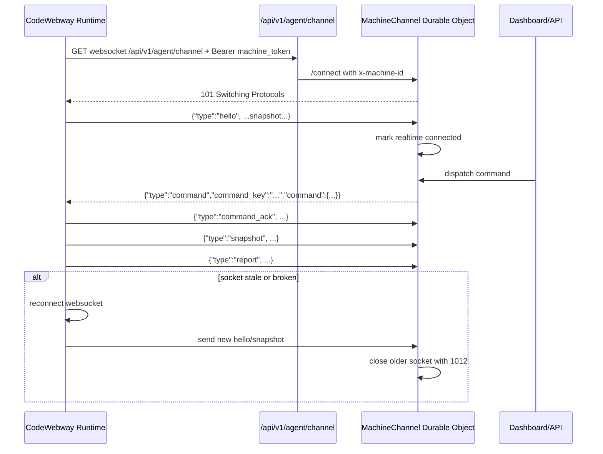

# Protocol And Session Lifecycle Extraction

Date: 2026-03-22

Purpose: extract the protocol and session-lifecycle details that are already implemented across `WebWayFleet` and `CodeWebway`, so they can be reused as input for a new project design.

Source of truth used for this note:

- `WebWayFleet/api/src/routes/device.ts`
- `WebWayFleet/api/src/routes/agent.ts`
- `WebWayFleet/api/src/middleware/auth-machine.ts`
- `WebWayFleet/api/src/durable-objects/machine-channel.ts`
- `WebWayFleet/api/src/lib/machine-channel.ts`
- `WebWayFleet/api/src/lib/machine-state.ts`
- `WebWayFleet/agent/src/api.rs`
- `WebWayFleet/agent/src/main.rs`
- `WebWayFleet/agent/tests/integration.rs`
- `WebWayFleet/api/test/routes/commands.test.ts`
- `WebWayFleet/api/test/durable-objects/machine-channel.test.ts`
- `WebWayFleet/api/test/setup.ts`
- `CodeWebway/src/fleet.rs`

## 1. Implementation Status Map

There are effectively two protocol layers in the current system:

1. `WebWayFleet/agent` current production behavior
   - HTTP polling only.
   - Uses `POST /api/v1/agent/heartbeat` and `POST /api/v1/agent/report`.
   - Does not open websocket realtime channel.
   - Does not emit `hello`, `snapshot`, `command_ack`, or websocket `report`.

2. `CodeWebway/src/fleet.rs` plus `WebWayFleet` realtime backend
   - Implements websocket machine channel on top of the same machine token.
   - Supports `hello`, `snapshot`, `command`, `command_ack`, and `report`.
   - Contains reconnect, duplicate suppression, stale-channel detection, and sparse heartbeat/lease reconciliation.

Important design takeaway:

- If you want protocol input for the new system, use `WebWayFleet/agent` as the current minimal deployed contract.
- Use `CodeWebway/src/fleet.rs` plus the Durable Object channel as the richer legacy/reference design for realtime session lifecycle.

## 2. Enrollment / First Bind Flow

Two entry paths exist.

### 2.1 Device-code enrollment flow

This is the cleaner first-bind flow.



Actual request/response shapes:

`POST /api/v1/device/request`

```json
{
  "machine_name": "devbox-01"
}
```

Response:

```json
{
  "data": {
    "code": "K7X-29M",
    "expires_in": 300,
    "activate_url": "https://codewebway.com/activate?c=K7X-29M&m=devbox-01"
  }
}
```

`GET /api/v1/device/poll?code=K7X-29M`

Pending:

```json
{
  "data": {
    "status": "pending"
  }
}
```

Approved:

```json
{
  "data": {
    "status": "approved",
    "enable_token": "raw-enable-token"
  }
}
```

Expired:

```json
{
  "data": {
    "status": "expired"
  }
}
```

`POST /api/v1/device/confirm`

Existing machine:

```json
{
  "code": "K7X-29M",
  "machine_id": "machine_123"
}
```

Create machine/project inline:

```json
{
  "code": "K7X-29M",
  "create": {
    "machine_name": "devbox-01",
    "project_name": "Infra"
  }
}
```

`POST /api/v1/agent/enable`

Actual shape accepted by server:

```json
{
  "enable_token": "raw-enable-token",
  "machine_id": "",
  "os": "macos",
  "arch": "aarch64",
  "hostname": "devbox-01",
  "agent_version": "0.1.0"
}
```

Response:

```json
{
  "data": {
    "machine_token": "raw-machine-token",
    "machine_id": "machine_123"
  }
}
```

Notes:

- `enable_token` is single-use.
- Server stores only `sha256(enable_token)`.
- On successful enable, server rotates the machine into a new `machine_token` and returns the raw token once.
- The machine row is updated with `os`, `arch`, `hostname`, `agent_version`, and `status = "offline"`.

### 2.2 Dashboard-generated enable token flow

There is also a direct flow where dashboard creates machine first and returns an enable token:

- `POST /api/v1/projects/:projectId/machines`
- `POST /api/v1/machines/:machineId/enable-token`

Both create a DB row in `enable_tokens` and return raw `enable_token`.

This path is simpler operationally, but device-code flow is the better protocol reference for zero-touch bootstrap.

## 3. Auth Handshake Between Machine And Serverless

### 3.1 Bootstrap auth

- Bootstrap uses `enable_token`.
- API hashes it with SHA-256 and looks it up in `enable_tokens.token`.
- Token must exist, be unused, and `expires_at` must be in the future.

### 3.2 Steady-state auth

Every agent call after enable uses:

```http
Authorization: Bearer <machine_token>
```

Server-side auth behavior:

- `machineAuth()` hashes the raw bearer token with SHA-256.
- It accepts either:
  - `machines.machine_token`, or
  - `machines.machine_token_prev` if `machine_token_prev_expires_at > now`.

This means credential rotation has built-in grace overlap.

### 3.3 Runtime-specific derived trust in CodeWebway

When `CodeWebway` receives `run_codewebway`, it derives extra local auth material:

- `password`: random 24-char session password for that runtime launch
- `sso_shared_secret`: `sha256(machine_token)`
- `runtime_instance_id`: usually equal to `execution_id`
- `dashboard_auth_machine_token`: current machine token

This means the machine token is the root secret for:

- agent-to-serverless auth
- runtime SSO secret derivation
- dashboard ticket verification path

## 4. Session Lifecycle

### 4.1 Current WebWayFleet agent lifecycle

Current Rust agent is heartbeat-driven:



Properties:

- Heartbeat timer is 60 seconds in `WebWayFleet/agent`.
- Command transport is request-response, not push.
- No explicit session resume opcode exists in this agent.

### 4.2 Realtime websocket lifecycle

This exists in `CodeWebway/src/fleet.rs` and `api/src/durable-objects/machine-channel.ts`.



Important behavior:

- Server does not have a dedicated `resume` message.
- Resume is implicit: reconnect socket, send `hello`, then `snapshot`.
- Queued commands are stored in Durable Object storage and re-delivered after reconnect.
- Heartbeat does not claim queued commands. Reconnect plus queued-command redelivery is the only command resume path.

## 5. Real Message Shapes

### 5.1 Heartbeat request

Current minimal payload from `WebWayFleet/agent`:

```json
{
  "status": "idle",
  "active_url": "https://abc.share.zrok.io/"
}
```

Richer payload accepted by API and used by `CodeWebway`:

```json
{
  "status": "running",
  "active_url": "https://abc.share.zrok.io/",
  "runtime_instance_id": "ex_123",
  "agent_version": "1.1.0-beta.47",
  "skip_status_write": false
}
```

### 5.2 Heartbeat response without command

Observed in `WebWayFleet/agent/tests/integration.rs`:

```json
{
  "data": {
    "has_command": false
  }
}
```

Current API may also include:

```json
{
  "data": {
    "has_command": false,
    "token_rotation_recommended": false
  }
}
```

Note:

- `token_rotation_recommended` is emitted by API when auth succeeded via previous token.
- Current `WebWayFleet/agent` client does not deserialize or use this field.

### 5.3 Heartbeat command delivery

As of 2026-03-25, the realtime command plane is authoritative.

- `/api/v1/agent/heartbeat` no longer returns commands.
- Queued commands are delivered only through the websocket machine channel.
- The older heartbeat command shape remains relevant only as historical context for legacy `WebWayFleet/agent`.

### 5.4 Command payload examples

`sync_commands`

```json
{
  "type": "sync_commands",
  "payload": {
    "slots": [
      {
        "slot": 1,
        "name": "Start Terminal",
        "script": "codewebway -z",
        "output_type": "codewebway_url"
      },
      {
        "slot": 2,
        "name": "Stop",
        "script": "pkill codewebway",
        "output_type": "status_only"
      }
    ]
  }
}
```

`run_slot`

```json
{
  "type": "run_slot",
  "payload": {
    "slot": 1,
    "execution_id": "ex_run_slot_001",
    "script": "echo hi",
    "output_type": "status_only"
  }
}
```

`run_codewebway`

```json
{
  "type": "run_codewebway",
  "payload": {
    "execution_id": "ex_runtime_001",
    "output_type": "codewebway_url",
    "fleet_api_base": "https://api.webwayfleet.dev",
    "cwd": "~/machine-policy",
    "shell": "/bin/zsh",
    "terminal_only": true,
    "scrollback": 262144,
    "max_connections": 10,
    "temp_link": true,
    "temp_link_ttl_minutes": 15,
    "temp_link_scope": "read-only",
    "temp_link_max_uses": 2
  }
}
```

`stop_codewebway`

```json
{
  "type": "stop_codewebway",
  "payload": {
    "execution_id": "ex_stop_001"
  }
}
```

`update_codewebway`

```json
{
  "type": "update_codewebway",
  "payload": {
    "execution_id": "ex_update_001",
    "release_channel": "stable",
    "release_tag": "v1.0.2",
    "release_api_base": "https://api.github.com/repos/iylmwysst/CodeWebway"
  }
}
```

### 5.5 Realtime websocket messages

Client `hello`:

```json
{
  "type": "hello",
  "status": "idle",
  "agent_version": "1.1.0-beta.47"
}
```

Client `snapshot`:

```json
{
  "type": "snapshot",
  "status": "running",
  "active_url": "https://abc.share.zrok.io/",
  "runtime_instance_id": "ex_runtime_001",
  "agent_version": "1.1.0-beta.47",
  "skip_status_write": true
}
```

Server `command` envelope:

```json
{
  "type": "command",
  "command_key": "execution:ex_runtime_001",
  "command": {
    "type": "run_codewebway",
    "payload": {
      "execution_id": "ex_runtime_001"
    }
  }
}
```

Client `command_ack`:

```json
{
  "type": "command_ack",
  "command_key": "execution:ex_runtime_001",
  "execution_id": "ex_runtime_001",
  "duplicate": false
}
```

Client websocket `report`:

```json
{
  "type": "report",
  "execution_id": "ex_runtime_001",
  "status": "success",
  "output": "{\"kind\":\"codewebway_runtime\",\"url\":\"https://abc.share.zrok.io/\",\"access_token\":\"secret\",\"access_token_ttl_secs\":43200,\"runtime_instance_id\":\"ex_runtime_001\"}"
}
```

### 5.6 Messages that do not exist today

There is no explicit message type for:

- `resume`
- `reconnect`
- `session_resumed`

Reconnect is transport-level only. The semantic recovery path is:

1. reconnect websocket
2. send `hello`
3. send `snapshot`
4. Durable Object re-delivers any still-pending commands
5. if realtime is still absent, command delivery remains unavailable until reconnect succeeds

## 6. Reconnect / Resume Rules

### 6.1 Server-side realtime rules

From `machine-channel.ts`:

- Only one active websocket per machine.
- New connect closes previous socket with code `1012`.
- If socket disconnects, DO marks realtime disconnected and starts a `60_000 ms` grace alarm.
- If no socket returns before alarm and machine looks stale, machine may be marked offline.

### 6.2 Client-side realtime rules in CodeWebway

From `CodeWebway/src/fleet.rs`:

- Connect retry interval: 10 seconds.
- Ping interval: 30 seconds.
- If no inbound activity for 90 seconds, client forces reconnect.
- While connected and idle, heartbeat still runs as a periodic reconcile/token-maintenance path.
- Duplicate command suppression uses `command_key` or `execution_id` with a 30-minute TTL.

### 6.3 Current command resume rules

The command plane is now websocket-only:

- If a socket is active, commands can be delivered immediately.
- If the machine has a remembered channel but no active socket, commands may remain queued in Durable Object storage until reconnect.
- If the machine has no remembered realtime channel, control actions fail fast with `CONTROL_CHANNEL_UNAVAILABLE`.

This makes reconnect behavior more explicit and removes heartbeat polling as a hidden second command path.

## 7. Credential Revoke / Rotate

### 7.1 Rotation

`POST /api/v1/agent/token/rotate`

Behavior:

- Refused with `409 TERMINAL_ACTIVE` if machine has active runtime URL.
- Generates new raw machine token.
- Stores:
  - `machine_token_prev = current machine_token`
  - `machine_token_prev_expires_at = now + 24h`
  - `machine_token = new hash`
  - `machine_token_rotated_at = now`

Response:

```json
{
  "data": {
    "machine_token": "new-raw-token",
    "previous_token_valid_until": 1743012345678
  }
}
```

Rotation usage in clients:

- `WebWayFleet/agent`: rotates every 7 days when not `running`.
- `CodeWebway`: same 7-day cadence, retries later on failure or conflict.

### 7.2 Revoke

There is no standalone `revoke token` endpoint.

Effective revoke paths are:

1. delete machine row from dashboard/API
   - future authenticated calls return `401 Invalid token`
2. rotate token and wait out `machine_token_prev_expires_at`
3. local disable
   - removes local config only
   - does not revoke server-side machine record by itself

Important operational note:

- `webwayfleet disable` and `codewebway disable` remove local credentials, but dashboard-side machine deletion is still required to fully revoke server trust.

## 8. Schema Slice Relevant To Protocol

Relevant `machines` columns observed in current test schema:

- `id`
- `project_id`
- `user_id`
- `name`
- `machine_token`
- `machine_token_prev`
- `machine_token_prev_expires_at`
- `machine_token_rotated_at`
- `status`
- `last_seen`
- `active_url`
- `runtime_instance_id`
- `runtime_started_at`
- `transport_mode`
- `transport_connected`
- `channel_connected_at`
- `last_channel_event_at`
- `os`
- `arch`
- `hostname`
- `agent_version`

Relevant `enable_tokens` columns:

- `id`
- `machine_id`
- `user_id`
- `token`
- `used_at`
- `expires_at`
- `created_at`

Relevant `command_executions` columns:

- `id`
- `command_id`
- `machine_id`
- `triggered_by`
- `status`
- `output`
- `command_name`
- `slot_num`
- `started_at`
- `completed_at`
- `created_at`

## 9. Agent Local Trust Boundary

Current local trust boundary is simple and strong enough to reuse:

Stored on disk:

- machine token
- machine id
- API base URL
- token issued timestamp
- local PIN in some flows
- synced command slots

Execution model:

- command slots execute with `sh -c`
- runtime start/stop/update commands are privileged local operations
- output returned to control plane can mutate machine state
  - example: a successful `run_codewebway` report can set `active_url`, `runtime_instance_id`, and terminal access token

Trust assumptions:

- possession of machine token is sufficient for serverless control-plane access
- possession of local disk config is enough to impersonate the machine
- for `CodeWebway`, machine token also seeds runtime SSO material, so compromise has larger blast radius than just heartbeat/report

## 10. Practical Design Notes For The New Project

If you are drafting protocol v1 from this system, the safest carry-over is:

1. Keep bootstrap as one-time `enable_token` -> long-lived `machine_token`.
2. Keep steady-state auth as bearer machine token with overlap rotation window.
3. Treat heartbeat as mandatory baseline transport.
4. Treat websocket as optional accelerator, not the only control path.
5. Standardize `command_key` as the command identity everywhere.
6. If you want true session resume, add an explicit `resume` handshake rather than relying only on reconnect + redelivery.

If you want to stay close to what already exists, the protocol objects worth preserving first are:

- `enable_token`
- `machine_token`
- `command_key`
- `execution_id`
- `runtime_instance_id`
- `transport_mode`
- `transport_connected`

Open inconsistencies worth cleaning in a redesign:

- current `WebWayFleet/agent` ignores realtime channel entirely
- `token_rotation_recommended` is emitted but not consumed by current agent
- there is no explicit `resume` opcode
- command naming around decommission is not fully uniform across files
